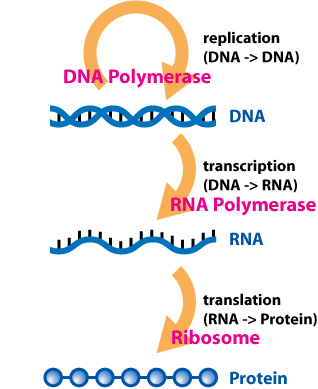
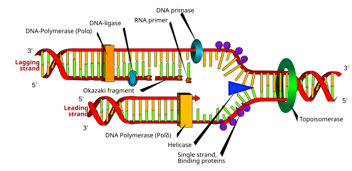

# The Central Dogma

## The Most Important Rule in Biology

### What Is the Central Dogma?

The **Central Dogma** is the most important rule about how genetic information flows in living things. It describes the journey from DNA to proteins.

Don't worry—"dogma" is just a fancy word for a rule or principle. And "central" means it's super important!

### The Simple Version

Here's the central dogma in its simplest form:

**DNA → RNA → Protein**

Or in words:
**DNA makes RNA, and RNA makes Protein**



**Figure 3.1**: The Central Dogma of molecular biology showing the flow of genetic information from DNA to RNA (transcription) to Protein (translation).

*Image credit: Wikimedia Commons, CC BY-SA 4.0*

Think of it like a factory assembly line:

1. **DNA** is the blueprint/instruction manual (stored in the office)

2. **RNA** is the work order/copy of instructions (delivered to the factory floor)

3. **Protein** is the finished product (built following the instructions)

## The Two Main Steps

The central dogma has two main steps with fancy names. Let's learn what they mean!

### Step 1: Transcription (DNA → RNA)

**Transcription** means "copying" or "writing out."

#### What Happens:
- The DNA stays safely in the nucleus (like the original cookbook stays in the library)

- A special enzyme "reads" the DNA

- It makes a copy of the instructions using RNA letters

- This copy is called **mRNA** (messenger RNA)

#### Think of It Like This:
Imagine you have a precious, old cookbook you want to protect:

- You wouldn't take it into the kitchen where it might get dirty

- Instead, you'd photocopy the recipe you need

- The photocopy goes to the kitchen, not the original book!

That's exactly what transcription does—it makes a temporary copy (RNA) of the permanent instructions (DNA).

#### The Details:
1. DNA unzips (the twisted ladder opens up)

2. An enzyme called **RNA polymerase** reads one side of the DNA

3. It builds an RNA strand using the DNA as a template

4. The RNA uses the same letters as DNA, except U (Uracil) instead of T (Thymine)

**Pairing Rules:**

- DNA has **A** → RNA gets **U**

- DNA has **T** → RNA gets **A**

- DNA has **G** → RNA gets **C**

- DNA has **C** → RNA gets **G**

### Step 2: Translation (RNA → Protein)

**Translation** means changing from one language to another.

#### What Happens:
- The mRNA leaves the nucleus and goes to a protein-making factory called a **ribosome**

- The ribosome "reads" the RNA code

- It translates the RNA letters into amino acids

- The amino acids link together to make a protein

#### Think of It Like This:
Imagine you have a recipe written in French, but you speak English:

- You need to **translate** the recipe from French to English

- Once translated, you can follow the instructions to make the dish

That's what translation does—it changes the "language" from RNA code into amino acid sequences!

#### The Details:
1. mRNA attaches to a ribosome

2. The ribosome reads the mRNA in groups of 3 letters at a time

3. Each group of 3 letters is called a **codon**

4. Each codon tells the ribosome which amino acid to add next

5. **tRNA** (transfer RNA) brings the correct amino acids

6. The amino acids link together like beads on a string to form a protein

#### The Genetic Code:
Every 3 letters of RNA code for 1 amino acid. For example:

- **AUG** = Start making the protein! (and codes for amino acid Methionine)

- **UUU** = Add the amino acid Phenylalanine

- **GGG** = Add the amino acid Glycine

- **UAA** = Stop! The protein is finished!

This code is used by almost all living things on Earth—from bacteria to blue whales to you!

## Replication: Making Copies of DNA

Before we move on, there's one more important process: **Replication**.

### What Is Replication?

**Replication** means making a copy of DNA.

Every time a cell divides (to make new cells), it needs to copy all its DNA so the new cell gets a complete set of instructions.

#### How It Works:
1. The DNA double helix unzips down the middle

2. Each side serves as a template

3. New DNA letters attach to each side following the pairing rules (A with T, G with C)

4. You end up with two identical copies of the original DNA



**Figure 3.2**: Semi-conservative DNA replication showing the double helix unwinding and each strand serving as a template for a new complementary strand.

*Image credit: Mariana Ruiz LadyofHats, Wikimedia Commons, CC BY-SA 3.0*

Think of it like:

- Unzipping a zipper

- Each side of the zipper gets new matching teeth

- Now you have two complete zippers!

## Exceptions to the Rule

The central dogma works for most living things, most of the time. But biology has some rule-breakers!

### Exception 1: Reverse Transcription

**What Normally Happens**: DNA → RNA → Protein

**What Sometimes Happens**: RNA → DNA

Some viruses (like HIV) store their genetic information as RNA instead of DNA. When they infect a cell, they can make DNA from their RNA using an enzyme called **reverse transcriptase**.

It's like going backward on a one-way street!

### Exception 2: RNA-Dependent RNA Synthesis

**What Normally Happens**: DNA → RNA → Protein

**What Sometimes Happens**: RNA → RNA

Some viruses can make RNA directly from RNA, without using DNA at all!

### Exception 3: Proteins Directly Affecting DNA

Sometimes proteins can affect which genes are turned on or off, creating a feedback loop. It's not breaking the central dogma, but it shows that biology is more complex than a simple one-way street!

## Viral Genomes: Special Cases

### Viruses Are Weird!

Viruses are not quite alive and not quite dead. They're in between! And they have strange genomes:

**Types of Viral Genomes:**

1. **DNA Viruses**

   - Their genome is DNA (like ours)

   - They follow the normal central dogma

   - Examples: Chickenpox, herpes

2. **RNA Viruses**

   - Their genome is RNA (not DNA!)

   - They need to make proteins directly from RNA

   - Examples: Flu, common cold, COVID-19

3. **Retroviruses**

   - Their genome is RNA

   - They convert their RNA into DNA using reverse transcriptase

   - Then they follow normal DNA → RNA → Protein

   - Example: HIV

### Why This Matters:

Understanding how viruses break the rules helps scientists:

- Develop better medicines and vaccines

- Understand evolution

- Learn about the flexibility of life

---

## Baltimore Classification of Viruses

### Understanding Viral Diversity Through Replication Strategy

**What is the Baltimore Classification?**

In 1971, **David Baltimore** (Nobel Prize winner) proposed a revolutionary way to classify all viruses based on how they produce mRNA. This system is brilliant because:

- **All viruses must make mRNA** to produce proteins
- Different viruses use completely different routes to get to mRNA
- The pathway to mRNA determines the viral replication strategy
- It's universal—works for ALL viruses!

Think of it like this:
- All roads lead to Rome (mRNA)
- But different viruses take completely different highways to get there!

**Concept and Rationale: The mRNA-Based Classification**

**The Central Question**: How does a virus go from its genome to mRNA?

**Why this matters**:
- mRNA is required for protein synthesis
- All ribosomes read mRNA (not DNA or RNA genomes directly)
- The route to mRNA reveals the virus's replication strategy
- Determines which enzymes the virus needs
- Guides antiviral drug development!

**The Fundamental Rules**:
1. Host cell ribosomes only translate mRNA (in the (+) sense)
2. Viral genome can be DNA or RNA
3. If RNA, can be (+) sense or (−) sense
4. Some genomes must be converted to mRNA, others are already mRNA!

**Sense vs. Antisense**:
- **(+) sense RNA** = "Positive sense" = Same sequence as mRNA, can be directly translated
- **(−) sense RNA** = "Negative sense" = Complementary to mRNA, must be copied first
- Like having instructions in English (+) vs. mirror-reversed English (−)

---

### The Seven Classes of Viruses (Classes I–VII)

Baltimore defined **seven classes** based on genome type and the path to mRNA:

---

#### **Class I: Double-Stranded DNA Viruses (dsDNA)**

**Genome**: Double-stranded DNA (just like cellular DNA!)

**Path to mRNA**: DNA → mRNA (using host or viral RNA polymerase)

**Strategy**:
- Most similar to cellular organisms
- Genome can be linear or circular
- Use host cell's transcription machinery (or bring their own)
- Often replicate in the nucleus

**Replication**:
1. Viral dsDNA enters cell
2. Transcribed to mRNA by RNA polymerase
3. mRNA translated to proteins
4. Viral DNA replicated by DNA polymerase
5. New virions assembled

**Examples**:
- **Herpesviruses** (HSV-1, HSV-2, VZV, EBV, CMV)
  - Chickenpox and shingles (VZV)
  - Cold sores and genital herpes (HSV)
  - Mononucleosis (EBV)
- **Adenoviruses** (common cold, conjunctivitis)
- **Poxviruses** (Smallpox - eradicated!, Monkeypox)
- **Papillomaviruses** (HPV - causes warts and cervical cancer)
- **Polyomaviruses**

**Key Features**:
- Genome: 5 kb (papilloma) to 375 kb (Megavirus)
- Usually linear, some circular
- Many encode their own DNA polymerase
- Some remain latent (herpes)

**Clinical Significance**:
- Many cause lifelong infections (latency)
- HSV hides in nerve cells
- HPV vaccine prevents cancer!

---

#### **Class II: Single-Stranded DNA Viruses (ssDNA)**

**Genome**: Single-stranded DNA

**Path to mRNA**: ssDNA → dsDNA → mRNA

**Strategy**:
- Must first convert ssDNA to dsDNA intermediate
- Use host DNA polymerase
- Then transcribe like Class I
- Small genomes (limited coding capacity)

**Replication**:
1. ssDNA enters cell
2. Host polymerase creates complementary strand → dsDNA
3. dsDNA transcribed to mRNA
4. Proteins produced
5. dsDNA replicated to make more ssDNA genomes
6. Package ssDNA into virions

**Examples**:
- **Parvoviruses**:
  - Human parvovirus B19 (fifth disease in children)
  - Adeno-associated virus (AAV) - used in gene therapy!
- **Circoviruses** (animal pathogens)
- **Geminiviruses** (plant viruses)

**Key Features**:
- Very small genomes (2-6 kb)
- Depend heavily on host cell machinery
- Often require dividing cells (need host polymerase activity)
- AAV is non-pathogenic, perfect for gene therapy!

**Clinical Significance**:
- Parvovirus B19 causes "slapped cheek" rash
- AAV revolutionizing gene therapy (safe vector)

---

#### **Class III: Double-Stranded RNA Viruses (dsRNA)**

**Genome**: Double-stranded RNA

**Path to mRNA**: dsRNA → (+) ssRNA (mRNA)

**Strategy**:
- dsRNA is unusual (cells see it as danger signal!)
- Virus must bring its own RNA polymerase
- Never release naked dsRNA (would trigger immunity)
- Transcription happens inside viral capsid

**Replication**:
1. dsRNA genome stays in viral core (protected)
2. Viral RNA-dependent RNA polymerase (RdRp) transcribes (−) strand
3. Produces (+) sense mRNA (exits capsid)
4. mRNA translated to proteins
5. New (+) strands made
6. (+) strands used as template for (−) strand → dsRNA
7. Package into new virions

**Examples**:
- **Reoviridae family**:
  - **Rotavirus** (major cause of infant diarrhea worldwide!)
  - Bluetongue virus (sheep/cattle)
  - Colorado tick fever virus
- **Birnaviruses** (fish pathogens)

**Key Features**:
- Genome: 10-30 kb, segmented (10-12 segments for rotavirus)
- Always carry RdRp enzyme inside virion
- Replicate in cytoplasm
- dsRNA never exposed (avoid immune detection)

**Clinical Significance**:
- Rotavirus: Leading cause of severe diarrhea in infants
- Rotavirus vaccines highly effective!
- Before vaccine: ~500,000 child deaths/year globally

---

#### **Class IV: Positive-Sense Single-Stranded RNA Viruses ((+)ssRNA)**

**Genome**: (+) sense ssRNA (same sense as mRNA!)

**Path to mRNA**: (+)ssRNA = mRNA (direct!)

**Strategy**:
- Genome IS mRNA!
- Can be directly translated by ribosomes
- Simplest path to protein
- Very common (>1/3 of all viruses)

**Replication**:
1. (+)ssRNA genome enters cell
2. Ribosomes directly translate it → viral proteins
3. Viral RdRp produced
4. RdRp makes (−) strand intermediate
5. (−) strand is template for more (+) strands
6. New (+) strands packaged

**Examples**:
- **Picornaviruses**:
  - **Poliovirus** (nearly eradicated!)
  - **Rhinoviruses** (common cold)
  - **Hepatitis A virus**
  - Coxsackievirus, echovirus
- **Flaviviruses**:
  - **Hepatitis C virus**
  - **Dengue virus**
  - **Zika virus**
  - **West Nile virus**
  - **Yellow fever virus**
- **Coronaviruses**:
  - **SARS-CoV-2** (COVID-19!)
  - SARS-CoV-1, MERS-CoV
  - Common cold coronaviruses (229E, OC43, NL63, HKU1)
- **Togaviruses** (rubella, chikungunya)
- **Caliciviruses** (norovirus - stomach flu!)

**Key Features**:
- Genome: 7-30 kb
- Often have 5' cap and 3' poly-A tail (like mRNA!)
- Translate polyprotein, cleaved into individual proteins
- Replicate in cytoplasm

**Clinical Significance**:
- HUGE medical importance (polio, hepatitis C, COVID-19!)
- Many vaccine-preventable (polio, hepatitis A, rubella, COVID-19)
- Polio vaccine success story
- COVID-19 pandemic (SARS-CoV-2)

---

#### **Class V: Negative-Sense Single-Stranded RNA Viruses ((−)ssRNA)**

**Genome**: (−) sense ssRNA (complementary to mRNA)

**Path to mRNA**: (−)ssRNA → (+)ssRNA (mRNA)

**Strategy**:
- Genome is "negative" (antisense)
- Cannot be directly translated
- Must first make (+) sense mRNA
- Virus carries RdRp enzyme
- Transcribe (−) strand to make mRNA

**Replication**:
1. (−)ssRNA genome enters cell
2. Viral RdRp (brought with virion) transcribes (−) strand
3. Produces (+) sense mRNA
4. mRNA translated → proteins
5. New RdRp made
6. Full-length (+) strand created
7. (+) strand is template for new (−) genomes
8. Package (−) ssRNA (+ RdRp enzyme!)

**Examples**:
- **Orthomyxoviruses**:
  - **Influenza A, B, C** (flu!)
- **Paramyxoviruses**:
  - **Measles virus**
  - **Mumps virus**
  - **Respiratory syncytial virus (RSV)**
  - **Parainfluenza virus**
- **Rhabdoviruses**:
  - **Rabies virus**
- **Filoviruses**:
  - **Ebola virus**
  - **Marburg virus**
- **Bunyaviruses**:
  - Hantavirus, Rift Valley fever virus

**Key Features**:
- Genome: 10-16 kb
- Often segmented (influenza has 8 segments)
- Must package RdRp with genome
- Replicate in cytoplasm (except influenza - nucleus)

**Clinical Significance**:
- Influenza: Seasonal epidemics, occasional pandemics
- Measles: Vaccine-preventable, highly contagious
- Rabies: Nearly 100% fatal without post-exposure vaccine!
- Ebola: High mortality, hemorrhagic fever

---

#### **Class VI: Reverse-Transcribing RNA Viruses (ssRNA-RT)**

**Genome**: (+) sense ssRNA (BUT uses reverse transcription!)

**Path to mRNA**: (+)ssRNA → dsDNA → mRNA

**Strategy**:
- Genome is RNA
- But must go through DNA intermediate!
- Uses **reverse transcriptase** enzyme
- Integrates into host chromosome
- Revolutionary discovery (Nobel Prize!)

**Replication**:
1. (+)ssRNA genome enters cell
2. **Reverse transcriptase** (RT) makes DNA from RNA!
   - First makes (−) DNA strand
   - Then makes (+) DNA strand → dsDNA
3. dsDNA integrates into host chromosome (provirus)
4. Host transcribes proviral DNA → mRNA
5. Some mRNA translated (proteins)
6. Some mRNA packaged as genome (RNA!)
7. New virions with RNA genome released

**Examples**:
- **Retroviruses**:
  - **HIV-1 and HIV-2** (AIDS)
  - Human T-cell leukemia virus (HTLV-1)
  - Feline leukemia virus (FeLV)
  - Mouse mammary tumor virus (MMTV)
- **Endogenous retroviruses**: Ancient integrated retroviruses in human genome (~8%!)

**Key Features**:
- Genome: 7-12 kb (diploid - two copies!)
- Encode reverse transcriptase (RT)
- Integrate into host DNA (permanent!)
- Can be transmitted vertically (parent to child via chromosomes)

**Clinical Significance**:
- HIV/AIDS pandemic: 40+ million deaths since 1981
- Antiretroviral therapy (ART) targets RT
- RT inhibitors: AZT, tenofovir, emtricitabine
- Proviral integration makes HIV uncurable (latent reservoirs)

**Historical Impact**:
- Discovery of reverse transcription contradicted central dogma
- David Baltimore & Howard Temin won Nobel Prize (1975)
- Showed information can flow RNA → DNA!

---

#### **Class VII: Reverse-Transcribing DNA Viruses (dsDNA-RT)**

**Genome**: Partially double-stranded DNA (with gaps!)

**Path to mRNA**: dsDNA → RNA → dsDNA → mRNA

**Strategy**:
- Genome is DNA
- But replicates through RNA intermediate!
- Uses reverse transcriptase (like retroviruses)
- Does NOT integrate (usually)

**Replication**:
1. Gapped dsDNA genome enters cell
2. Repair gaps → complete dsDNA
3. Transcribe dsDNA → RNA (long transcript)
4. RNA serves as:
   a) mRNA for translation
   b) Pregenomic RNA for replication
5. **Reverse transcriptase** makes DNA from RNA!
6. Creates new gapped dsDNA genome
7. Package into virions

**Examples**:
- **Hepadnaviruses**:
  - **Hepatitis B virus (HBV)** (major human pathogen!)
  - Duck hepatitis B virus
- **Caulimoviruses** (plant viruses)

**Key Features**:
- Genome: 3-8 kb (very small!)
- Circular dsDNA with gaps
- Encode reverse transcriptase
- Can integrate rarely (HBV)
- Replication in cytoplasm

**Clinical Significance**:
- HBV: 296 million chronic infections worldwide
- Causes cirrhosis and liver cancer
- Vaccine available (highly effective!)
- Antiviral drugs target RT (tenofovir, entecavir)
- Unlike HIV, HBV is vaccine-preventable!

---

### Differences Between DNA, RNA, and Reverse-Transcribing Viruses

**Comparison Table**:

| Feature | DNA Viruses (I, II) | RNA Viruses (III, IV, V) | Reverse-Transcribing (VI, VII) |
|---------|-------------------|----------------------|-------------------------------|
| **Genome** | DNA | RNA | RNA or DNA |
| **Replication** | DNA → DNA | RNA → RNA | RNA ↔ DNA |
| **Mutation rate** | Low (proofreading) | High (no proofreading) | High (RT error-prone) |
| **Integration** | Rare (some) | No (except retro) | Yes (VI), rare (VII) |
| **Latency** | Common (herpes) | Rare | Yes (HIV) |
| **Key enzyme** | DNA polymerase | RdRp (RNA-dependent RNA polymerase) | Reverse transcriptase (RT) |
| **Host machinery** | Often uses host | Brings own RdRp | Brings own RT |
| **Stability** | More stable | Less stable | Variable |
| **Evolution** | Slower | Faster | Fast |

**Mutation Rates**:
- **DNA viruses**: 10^-8 to 10^-6 mutations/bp/replication
  - DNA polymerases have proofreading
  - More accurate replication
  - Example: HSV, adenovirus
- **RNA viruses**: 10^-6 to 10^-4 mutations/bp/replication
  - RdRp lacks proofreading!
  - Error-prone replication
  - Rapid evolution, escape immunity
  - Example: Influenza, HIV, SARS-CoV-2
- **Reverse-transcribing**: 10^-5 to 10^-3 mutations/bp/replication
  - RT very error-prone
  - High genetic diversity
  - Drug resistance emerges quickly
  - Example: HIV (quasispecies)

**Why This Matters for Medicine**:
- RNA viruses mutate rapidly → hard to vaccinate (flu, HIV)
- DNA viruses more stable → vaccines work better (chickenpox, HPV)
- RT inhibitors crucial for HIV/HBV treatment
- Understanding replication guides antiviral design!

---

### Visual Flow: DNA/RNA → mRNA Routes

**Simplified Diagram** (conceptual):

```
Class I (dsDNA):     dsDNA ─→ mRNA
Class II (ssDNA):    ssDNA ─→ dsDNA ─→ mRNA
Class III (dsRNA):   dsRNA ─→ (+)ssRNA (mRNA)
Class IV (+ssRNA):   (+)ssRNA = mRNA (direct!)
Class V (−ssRNA):    (−)ssRNA ─→ (+)ssRNA (mRNA)
Class VI (ssRNA-RT): (+)ssRNA ─→ dsDNA ─→ mRNA
Class VII (dsDNA-RT):dsDNA ─→ RNA ─→ dsDNA ─→ mRNA
```

**All Routes Lead to mRNA!**

Every virus, no matter how weird, must produce mRNA to hijack the host ribosome and make proteins. The Baltimore system captures this beautifully.

---

### Significance in Molecular Virology and Vaccine Design

**For Understanding Viral Replication**:
- Predicts which enzymes virus needs
- Identifies drug targets (RT, RdRp)
- Explains mutation rates and evolution
- Guides lab culture methods

**For Vaccine Development**:

**Live attenuated vaccines** (weakened virus):
- Class I (DNA): Stable → Good vaccines (chickenpox, smallpox)
- Class IV (RNA): Unstable → Challenging (polio Sabin vaccine mutated back)
- Requires careful balance

**Inactivated vaccines** (killed virus):
- Works for many classes (polio Salk, influenza, hepatitis A)
- Safer but may need boosters

**Subunit vaccines** (pieces of virus):
- HPV (Class I): Capsid proteins only
- Hepatitis B (Class VII): Surface antigen
- COVID-19 mRNA vaccines: Express spike protein (Class IV virus)

**mRNA vaccines** (COVID-19):
- Based on understanding Class IV (+ssRNA) virology!
- Deliver mRNA encoding viral protein
- Host cells translate → immune response
- Brilliant application of virology knowledge

**For Antiviral Drug Development**:

**Targeting viral enzymes**:
- **RT inhibitors**: HIV (Class VI), HBV (Class VII)
  - NRTIs: AZT, tenofovir, emtricitabine
  - NNRTIs: efavirenz, nevirapine
- **RdRp inhibitors**: 
  - Hepatitis C: sofosbuvir (cure rate >95%!)
  - COVID-19: remdesivir, molnupiravir
- **Protease inhibitors**: HIV, HCV
- **Neuraminidase inhibitors**: Influenza (oseltamivir/Tamiflu)

**Baltimore classification guides**:
- Which enzymes are essential targets
- Which viruses are related (similar drugs might work)
- How resistance might emerge

---

### The Big Picture

**Baltimore Classification is Beautiful Because**:
1. **Universal**: Works for ALL viruses
2. **Functional**: Based on how viruses actually work
3. **Predictive**: Tells us what enzymes virus needs
4. **Practical**: Guides drug and vaccine design
5. **Simple**: Just seven classes capture all diversity!

**Key Insights**:
- Viruses have invented multiple solutions to the mRNA problem
- Some solutions are rare (Class III, VII) - evolutionary experiments
- Most viruses are Class I or IV - simple, successful strategies
- Reverse transcription (VI, VII) breaks central dogma rules!
- Understanding classification improves medical interventions

**Modern Relevance**:
- COVID-19 pandemic: Class IV virus
- HIV epidemic: Class VI virus
- Influenza pandemics: Class V virus
- Hepatitis B & C: Classes VI & IV
- Emerging viruses (Ebola, Zika): Classes V & IV

Baltimore classification isn't just taxonomy—it's a framework for understanding viral life cycles, evolution, and medical significance. Every virus fits somewhere, and knowing its class tells us volumes about how it works and how to fight it!

---

## Putting It All Together

Let's review the complete journey from DNA to protein:

### The Normal Path:

1. **Replication** (when cells divide)

   - DNA → DNA

   - Making copies of the instruction manual

2. **Transcription** (making mRNA)

   - DNA → RNA

   - Copying instructions from the manual

3. **Translation** (making proteins)

   - RNA → Protein

   - Building the final product

### The Big Picture:

Think of your cells like a factory:

- **DNA** = The master blueprints (kept safe in the office)

- **Transcription** = Photocopying specific blueprints

- **mRNA** = The photocopied work orders

- **Translation** = Following the work orders on the factory floor

- **Proteins** = The finished products that do the work

- **Replication** = Making exact copies of all the blueprints (for new factories)

## Why Is This Important?

Understanding the central dogma helps us:

1. **Understand Diseases**

   - Many diseases happen when something goes wrong in these processes

   - Some medicines work by affecting transcription or translation

2. **Develop New Technologies**

   - Scientists can now "edit" DNA (like spell-check for genes!)

   - We can make bacteria produce human proteins (like insulin for diabetes)

3. **Study Evolution**

   - All living things use the same basic process

   - This shows we're all connected through deep time

4. **Personalize Medicine**

   - Understanding your DNA can help doctors choose the best treatments for you

## Codon Bias: Not All Codons Are Equal!

### The Redundancy Problem

Remember the genetic code is **redundant** (also called "degenerate"):

- 64 possible codons (4³ = 4 × 4 × 4)

- Only 20 amino acids (+ 3 stop signals)

- **Multiple codons code for the same amino acid!**

**Example - Leucine**:

- Has **6 different codons**: UUA, UUG, CUU, CUC, CUA, CUG

- All mean "add leucine"

- So which one does the cell use?

**You might think**: All codons for an amino acid used equally, right?

**Wrong!** Different organisms have **codon preferences** (codon bias)!

### What Is Codon Bias?

**Codon bias** = Organisms preferentially use certain codons over others, even though they code for the same amino acid

**Example in E. coli bacteria**:

- Leucine codon **CTG** is used very often

- Leucine codon **CTA** is used rarely

- Both code for leucine!

- But bacteria "prefer" CTG

**Why does this happen?**

**1. tRNA Availability**:

- Different organisms have different amounts of different tRNAs

- Preferred codons match abundant tRNAs

- Allows faster, more efficient translation

**2. Translation Efficiency**:

- Highly expressed genes use "optimal" codons

- Optimal = codons with abundant matching tRNAs

- Faster translation = more protein made

**3. Translation Accuracy**:

- Some codons translated more accurately

- Important genes use more accurate codons

- Reduces errors in critical proteins

**4. Evolutionary Selection**:

- Natural selection favors efficient codon usage

- Especially in fast-growing organisms (like bacteria)

- Less pressure in slow-growing organisms

### Codon Bias Is Organism-Specific!

**Different organisms have different codon preferences!**

**Examples**:

| Amino Acid | Humans Prefer | E. coli Prefers | Yeast Prefers |
|------------|---------------|-----------------|---------------|
| Leucine | CTG | CTG | TTG |
| Arginine | CGC | CGT | AGA |
| Serine | AGC | AGC | TCT |

**This matters a LOT** for biotechnology!

### Practical Problem: Heterologous Gene Expression

**"Heterologous expression"** = Making one organism produce a protein from another organism

**Common scenario**:

- Take human gene

- Put it in bacteria

- Make bacteria produce human protein (like insulin!)

**The problem**:

```
Human gene uses human codon preferences
Bacteria have different tRNA abundances
→ Bacteria struggle to translate human gene!
→ Low protein production or even failure!
```

```

**Real example - Human insulin production**:

- Original human insulin gene → poor expression in E. coli

- Many codons rare in bacteria

- Translation stalls, protein misfolds

- **Solution needed!**

### Solution: Codon Optimization

**Codon optimization** = Changing DNA sequence to use host organism's preferred codons, **without changing the amino acid sequence**!

**How it works**:

1. Take human gene sequence

2. Identify which codons are rare in bacteria

3. Replace with synonymous codons preferred by bacteria

4. **Amino acid sequence stays identical!**

5. But bacteria translate it much better!

**Example - Leucine in human vs bacteria**:
```

```
Original human gene: ...UUA-UUA-UUA... (rare in bacteria)
                         ↓
Optimized for E. coli: ...CUG-CUG-CUG... (common in bacteria)

Both sequences code for: Leu-Leu-Leu
But bacteria prefer CUG!
```

```

**Results after optimization**:

- ✅ 10-100x more protein produced!

- ✅ Better protein folding

- ✅ Higher purity

- ✅ More economical production

**Real-world applications**:

- Insulin for diabetes (optimized for E. coli)

- Vaccines (optimized for yeast or bacteria)

- Industrial enzymes

- Research proteins

- Antibody production

### Codon Usage in Gene Prediction

Codon bias also helps in **bioinformatics**!

**How computers find genes**:

- Calculate codon usage in DNA sequence

- Compare to organism's known codon preferences

- Regions matching codon bias → likely coding!

- Regions not matching → likely non-coding

**Example**:
```

```
Sequence A: Uses organism's preferred codons → Probably a gene!
Sequence B: Random codon usage → Probably not a gene
```

```

This is one signal used in **ab initio gene prediction** (covered in Chapter 17a)!

### Codon Adaptation Index (CAI)

**CAI** = Measure of how well a gene's codons match organism's preferences

**Scale**: 0 to 1

- **CAI = 1.0**: Perfect match (uses all optimal codons)

- **CAI = 0.5**: Medium match

- **CAI < 0.3**: Poor match (uses rare codons)

**In practice**:

- Highly expressed genes: CAI ~0.7-0.9

- Lowly expressed genes: CAI ~0.3-0.5

- Foreign genes (before optimization): CAI often < 0.3

**Use in biotech**:

- Calculate CAI before cloning gene

- If CAI < 0.4 in host → optimize!

- Predicts expression success

### Exceptions and Special Cases

**Not all organisms show strong codon bias**:

- **Bacteria**: Strong bias (need efficiency!)

- **Yeast**: Moderate bias

- **Mammals**: Weaker bias (can afford inefficiency)

- **Plants**: Variable bias

**Why weaker bias in complex organisms?**

- Slower growth rate (less time pressure)

- More complex regulation needed

- Different selection pressures

**Rare codons can be functional!**

- Sometimes rare codons used intentionally

- Slow down translation at specific points

- Allow proper protein folding

- Regulatory mechanism!

### Key Takeaways - Codon Bias

- **Redundant genetic code**: Multiple codons per amino acid

- **Codon bias**: Organisms prefer certain synonymous codons

- **Organism-specific**: Each species has different preferences

- **Linked to tRNA availability**: Preferred codons have abundant tRNAs

- **Affects translation efficiency**: Optimal codons = faster translation

- **Critical for biotech**: Must optimize codons for heterologous expression

- **Used in gene prediction**: Codon usage helps identify coding regions

- **CAI metric**: Measures codon optimization

- **Can be regulatory**: Rare codons sometimes serve functions

**Bottom line**: The genetic code is universal, but codon preferences are not!

## Fun Facts! 🎉

- Your cells transcribe genes into RNA constantly—thousands of times per second!

- A typical human cell makes about 10,000 different proteins

- Translation happens incredibly fast—a ribosome can add about 20 amino acids per second

- The genetic code is almost universal—the same codons mean the same amino acids in nearly all living things

- Some proteins are just a few dozen amino acids long, while others have thousands!

- **Bacteria can prefer certain codons so strongly that rare codons are used <5% as often as optimal ones!**

## Key Takeaways

- **Central Dogma**: DNA → RNA → Protein (the flow of genetic information)

- **Transcription**: Making RNA from DNA (like photocopying a recipe)

- **Translation**: Making proteins from RNA (like following the recipe to cook)

- **Replication**: Making copies of DNA (when cells divide)

- **Genetic Code**: 3 RNA letters = 1 amino acid

- **Exceptions exist**: Some viruses use reverse transcription (RNA → DNA)

- **Universal process**: Almost all living things use the same basic system

- This understanding helps us develop medicines, study evolution, and understand diseases

---

**Sources**: Information adapted from Khan Academy (Intro to Gene Expression - Central Dogma), NHGRI Genetics Glossary, Nature Scitable, and Biology LibreTexts (Central Dogma of Molecular Biology).


This is one signal used in **ab initio gene prediction** (covered in Chapter 17a)!

### Codon Adaptation Index (CAI)

**CAI** = Measure of how well a gene's codons match organism's preferences

**Scale**: 0 to 1

- **CAI = 1.0**: Perfect match (uses all optimal codons)

- **CAI = 0.5**: Medium match

- **CAI < 0.3**: Poor match (uses rare codons)

**In practice**:

- Highly expressed genes: CAI ~0.7-0.9

- Lowly expressed genes: CAI ~0.3-0.5

- Foreign genes (before optimization): CAI often < 0.3

**Use in biotech**:

- Calculate CAI before cloning gene

- If CAI < 0.4 in host → optimize!

- Predicts expression success

### Exceptions and Special Cases

**Not all organisms show strong codon bias**:

- **Bacteria**: Strong bias (need efficiency!)

- **Yeast**: Moderate bias

- **Mammals**: Weaker bias (can afford inefficiency)

- **Plants**: Variable bias

**Why weaker bias in complex organisms?**

- Slower growth rate (less time pressure)

- More complex regulation needed

- Different selection pressures

**Rare codons can be functional!**

- Sometimes rare codons used intentionally

- Slow down translation at specific points

- Allow proper protein folding

- Regulatory mechanism!

### Key Takeaways - Codon Bias

- **Redundant genetic code**: Multiple codons per amino acid

- **Codon bias**: Organisms prefer certain synonymous codons

- **Organism-specific**: Each species has different preferences

- **Linked to tRNA availability**: Preferred codons have abundant tRNAs

- **Affects translation efficiency**: Optimal codons = faster translation

- **Critical for biotech**: Must optimize codons for heterologous expression

- **Used in gene prediction**: Codon usage helps identify coding regions

- **CAI metric**: Measures codon optimization

- **Can be regulatory**: Rare codons sometimes serve functions

**Bottom line**: The genetic code is universal, but codon preferences are not!

## Fun Facts! 🎉

- Your cells transcribe genes into RNA constantly—thousands of times per second!

- A typical human cell makes about 10,000 different proteins

- Translation happens incredibly fast—a ribosome can add about 20 amino acids per second

- The genetic code is almost universal—the same codons mean the same amino acids in nearly all living things

- Some proteins are just a few dozen amino acids long, while others have thousands!

- **Bacteria can prefer certain codons so strongly that rare codons are used <5% as often as optimal ones!**

## Key Takeaways

- **Central Dogma**: DNA → RNA → Protein (the flow of genetic information)

- **Transcription**: Making RNA from DNA (like photocopying a recipe)

- **Translation**: Making proteins from RNA (like following the recipe to cook)

- **Replication**: Making copies of DNA (when cells divide)

- **Genetic Code**: 3 RNA letters = 1 amino acid

- **Exceptions exist**: Some viruses use reverse transcription (RNA → DNA)

- **Universal process**: Almost all living things use the same basic system

- This understanding helps us develop medicines, study evolution, and understand diseases

---

**Sources**: Information adapted from Khan Academy (Intro to Gene Expression - Central Dogma), NHGRI Genetics Glossary, Nature Scitable, and Biology LibreTexts (Central Dogma of Molecular Biology).
